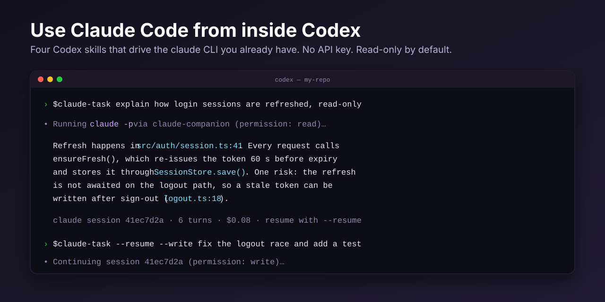
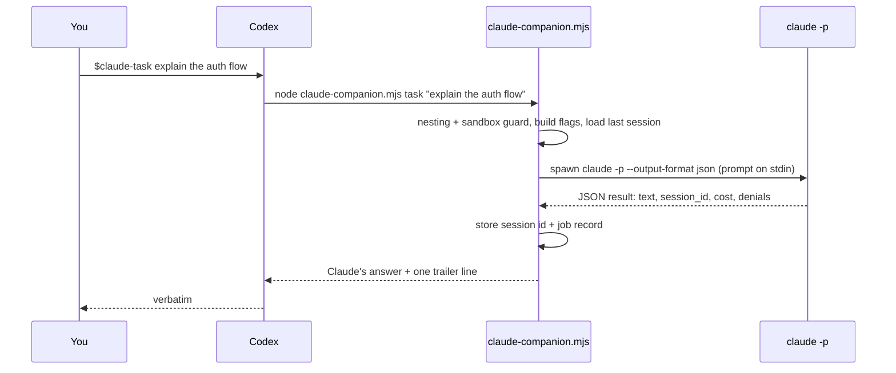

<p align="center">
  
</p>

# codex-claude-plugin

**Use Claude Code from inside OpenAI Codex.** Four Codex skills drive the `claude` CLI you already have installed. No API key, read-only by default, and it runs on macOS, Windows, and Linux.

[](https://github.com/k3nmastel2/codex-claude-plugin/actions/workflows/test.yml)
[](LICENSE)
[](#requirements)
[](https://github.com/k3nmastel2/codex-claude-plugin/stargazers)

OpenAI ships a plugin that lets Claude Code call Codex. This is the other direction. Install both and the two agents can hand work to each other from whichever one you happen to be in.

```bash
codex plugin marketplace add k3nmastel2/codex-claude-plugin
codex plugin add claude@codex-claude-plugin
```

## What you get

| Say to Codex | What happens |
|---|---|
| `$claude-task explain how sessions are refreshed` | Claude reads the repo and answers. Read-only. |
| `$claude-task --write fix the null check in auth.ts` | Claude may edit files inside the workspace. |
| `$claude-task --full run the tests and fix what fails` | Claude may edit and run commands. Skips every permission check. |
| `$claude-task --resume apply the top fix` | Continues the last Claude thread for this repo. |
| `$claude-task --background port the parser to TypeScript` | Returns a job id immediately; keep working. |
| `$claude-review` | Structured review of your dirty working tree, or your branch against its base. |
| `$claude-review --adversarial --base main focus on migrations` | Claude tries to break the change, with a focus. |
| `$claude-jobs status` · `result` · `cancel` | Manage background jobs. |
| `$claude-setup` | Checks Node, the `claude` CLI, login, sandbox, and nesting. Tells you exactly what to fix. |

Claude's answer comes back into your Codex thread verbatim, followed by one trailer line with the session id, turn count, and cost, so you always know what a run cost and how to continue it.

## Why

- **Two frontier models, two sets of blind spots.** Write with Codex, then have Claude review it before the PR. Or the reverse, with OpenAI's plugin.
- **No keys, no bills you didn't already have.** It runs the `claude` binary with the login you already use. Your Claude subscription pays for Claude, your Codex subscription pays for Codex.
- **Safe by default.** Claude starts read-only. Writing files and running commands are explicit flags you type.
- **It cannot loop.** Claude's Codex plugin can call Codex, which could call this plugin, which would call Claude. The companion refuses to nest, and it tells Claude not to delegate back.
- **Windows is not an afterthought.** Everything is Node, nothing goes through a shell, and CI runs the suite on Windows, macOS, and Linux.

## Requirements

- **Node.js 20 or newer** on your PATH (`node --version`).
- **Codex CLI 0.145 or newer**, or the Codex desktop app (`codex --version`).
- **Claude Code CLI, logged in.** Any install method works; see below.

## Install

### 1. Claude Code

If you already run `claude` in a terminal, skip to step 2.

| Platform | Command |
|---|---|
| macOS, Linux, WSL | `curl -fsSL https://claude.ai/install.sh \| bash` |
| Windows PowerShell | `irm https://claude.ai/install.ps1 \| iex` |
| Windows CMD | `curl -fsSL https://claude.ai/install.cmd -o install.cmd && install.cmd && del install.cmd` |
| Homebrew | `brew install --cask claude-code` |
| WinGet | `winget install Anthropic.ClaudeCode` |
| npm (Node 22+) | `npm install -g @anthropic-ai/claude-code` |

Then log in once, in your own terminal:

```bash
claude auth login
```

Claude Code needs a Pro, Max, Team, Enterprise, or Console account. An `ANTHROPIC_API_KEY` or a `CLAUDE_CODE_OAUTH_TOKEN` from `claude setup-token` in the environment also works.

### 2. The plugin

```bash
codex plugin marketplace add k3nmastel2/codex-claude-plugin
codex plugin add claude@codex-claude-plugin
```

Start a **new** Codex thread (skills load at thread start) and run:

```
$claude-setup
```

It reports `Ready: yes` or tells you the one thing to fix.

### 3. Codex sandbox

Codex runs commands inside a sandbox by default, and that sandbox has **no network access**, so Claude cannot reach its API from inside it. Codex handles this the way it handles any network tool: it asks to re-run the command with escalated permissions. Approve that prompt, or allow network for the workspace-write sandbox once in `~/.codex/config.toml`:

```toml
[sandbox_workspace_write]
network_access = true
```

The companion detects the sandbox and says exactly this if you forget.

## Permission levels

| Flag | Claude Code flags used | Claude can |
|---|---|---|
| (none) | `--permission-mode dontAsk --disallowedTools Edit,Write,MultiEdit,NotebookEdit` | Read, search, browse. Nothing else. |
| `--write` | `--permission-mode acceptEdits` | Also edit files inside the workspace. |
| `--full` | `--dangerously-skip-permissions` | Anything, including shell commands. Use in repos you trust. |
| `--allow "<rule>"` | `--allowedTools <rule>` | Add specific tools, e.g. `--allow "Bash(npm test:*)"`. |

`--model` and `--effort` pass straight through to Claude. Reviews are always read-only.

## How it works



- The four skills are thin forwarders: build one companion command, run it, return stdout unchanged.
- The prompt travels on stdin, never in argv, so large review contexts and Windows argument limits are never a problem.
- Reviews add `--json-schema`, so findings come back structured and are printed by severity with file and line numbers.
- Per-repo state (last session id, job records, logs) lives under `$CODEX_HOME/claude-companion/state/`, default `~/.codex/claude-companion/state/`.
- Background jobs run in a detached worker; `status`, `result`, and `cancel` read the job files. Cancel kills the whole process tree on every OS.
- Every run appends a short system prompt telling Claude it was invoked by Codex, that nobody can answer questions, and that it must not delegate back.

## Troubleshooting

**"Claude is not logged in"** even though `claude` works in your terminal. Almost always the Codex sandbox: the network is off inside it, so Claude cannot validate your login. Approve Codex's escalation prompt or enable `network_access` as shown above. If it persists, run `claude auth status` in your own terminal.

**"This Codex process was started inside a Claude Code session"**. You launched Codex from inside Claude Code (for example through Claude's own codex plugin) and the loop guard stopped a second Claude from starting. Run Codex from a normal terminal, or pass `--allow-nested` if you really mean it.

**"No base branch found; pass --base <ref>"**. Your working tree is clean and the repo has neither `origin/HEAD`, `main`, nor `master`. Tell the review what to compare against: `$claude-review --base develop`.

**"The claude CLI was not found on PATH"**. Install Claude Code (step 1) and open a fresh terminal so PATH updates. On Windows the companion finds `claude.exe` from the native installer and also unwraps the npm `claude.cmd` shim.

**Codex keeps running it inside the sandbox.** The skills ask Codex to request escalation. If your Codex config has `approval_policy = "never"`, Codex cannot ask; set `network_access = true` instead.

**Claude asked a question and stopped.** It should not; the appended system prompt forbids it. If it happens, resume with `$claude-task --resume` and answer in the prompt.

## FAQ

**Does this send my code anywhere new?** No. Claude Code sends your prompt and the files it reads to Anthropic exactly as it does when you run `claude` yourself. Codex never sees Claude's credentials, and this plugin has no server, telemetry, or network calls of its own.

**What does it cost?** Whatever your Claude Code plan charges for a session. The trailer line after every run shows the cost Claude reported. Pass `--model haiku` for cheap plumbing checks and `--max-budget-usd` to cap a run.

**Can Claude and Codex go back and forth?** By design, only one hop. This plugin refuses to run when it detects it is already inside a Claude Code session. Deliberate multi-hop workflows can raise `CLAUDE_COMPANION_MAX_DEPTH`.

**Can I use it from the Codex desktop app?** Yes. Install the plugin the same way; the desktop app reads the same marketplace list.

**Does `--resume` survive restarting Codex?** Yes. The session id is stored per repository and Claude keeps its own session files, so the next day's `--resume` still works.

**Why not an MCP server?** A skill plus a script is what Codex plugins are made of, it needs no server process, and it mirrors how OpenAI's own plugin works in the other direction.

## Companion CLI

Everything the skills do you can run yourself:

```
node plugins/claude/scripts/claude-companion.mjs setup [--json]
node plugins/claude/scripts/claude-companion.mjs task [--write|--full] [--allow <rule>]... [--resume|--fresh] [--model <m>] [--effort <e>] [--max-turns <n>] [--max-budget-usd <x>] [--add-dir <d>]... [--timeout-ms <n>] [--background] [--json] [--] <prompt|->
node plugins/claude/scripts/claude-companion.mjs review [--adversarial] [--base <ref>] [--scope auto|working-tree|branch] [--timeout-ms <n>] [--background] [--json] [focus...]
node plugins/claude/scripts/claude-companion.mjs status [job-id] [--all] [--json]
node plugins/claude/scripts/claude-companion.mjs result [job-id] [--json]
node plugins/claude/scripts/claude-companion.mjs cancel [job-id] [--json]
node plugins/claude/scripts/claude-companion.mjs resume-candidate --json
```

Environment overrides: `CLAUDE_COMPANION_CLAUDE_CMD` (command to run instead of `claude`; the tests use it), `CLAUDE_COMPANION_STATE_DIR`, `CLAUDE_COMPANION_MAX_DEPTH`, `CLAUDE_COMPANION_PROMPT_VIA_ARGV=1`.

## Ideas welcome

Things that would be fun and are not built yet. Open an issue or a PR.

- A `$claude-pair` skill: Codex writes, Claude reviews, Codex fixes, in one command.
- Gemini CLI as a third target, with the same companion contract.
- A stop-time review gate for Codex once Codex plugins support hooks.
- Streaming Claude's progress into the Codex thread instead of only the final message.

## Development

```bash
npm test
```

Tests use a fake `claude` binary, so they run without credentials or spend. See [CONTRIBUTING.md](CONTRIBUTING.md) for the reload loop and ground rules, [SECURITY.md](SECURITY.md) for reporting vulnerabilities, and `docs/superpowers/` for the original design spec and implementation plan.

## License

MIT. If this saves you a context switch, a star helps other people find it.
