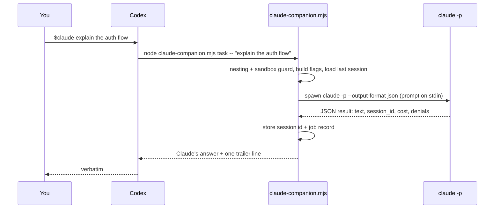

<p align="center">
  
</p>

# codex-claude-plugin: use Claude Code from inside OpenAI Codex

**A Codex plugin that turns Claude Code into a collaborator you can call from any Codex thread.** It drives the `claude` CLI you already have installed, so no API key is required, there is no proxy, and nothing to pay beyond what your Claude Code account already charges. Read-only by default. Runs on macOS, Windows, and Linux.

[](https://github.com/k3nmastel2/codex-claude-plugin/actions/workflows/test.yml)
[](LICENSE)
[](#requirements)
[](https://github.com/k3nmastel2/codex-claude-plugin/stargazers)

```bash
codex plugin marketplace add k3nmastel2/codex-claude-plugin
codex plugin add claude@codex-claude-plugin
```

Then, in a new Codex thread:

```
$claude review the change I just made
```

## Why this matters

OpenAI ships a plugin that lets **Claude Code call Codex**. This is the missing half: **Codex calling Claude Code**. Install both and each agent can be a sub-agent of the other, from whichever one you happen to be working in.

The point is not that one model is better. Each has strengths, blind spots, and a different way of reasoning about code, and the best results come from letting them work on the same problem. In one thread you can have Codex design, Claude challenge the design, Codex build, Claude inspect the build, Codex fix, Claude confirm. Two frontier models on every step, without leaving your editor or paying for anything you don't already have.

Concrete scenarios this makes routine:

- **Design under scrutiny.** Describe the architecture to Codex, then `$claude tear this design apart` before a line is written.
- **Build, then adversarial review.** Codex implements the feature; `$claude-review --adversarial` tries to break it before the PR opens.
- **Unstick a debugging session.** When Codex is going in circles, `$claude why does this test flake` brings a fresh set of assumptions.
- **Long work in the background.** `$claude-task --background port the parser to TypeScript` returns immediately; Codex keeps going and collects the result later.
- **Both directions.** With OpenAI's plugin on the Claude side too, either agent can delegate to the other: Claude asks Codex for an implementation pass, Codex asks Claude for a review of it.

## Three ways to invoke it

| Style | Example |
|---|---|
| One word | `$claude explain how sessions are refreshed` |
| Specific skill | `$claude-review --adversarial --base main focus on migrations` |
| Plain English | "ask Claude for a second opinion on this diff" |

Codex chooses the matching skill from the description, so the `$` prefix is optional once you mention Claude.

## What you get

| Say to Codex | What happens |
|---|---|
| `$claude-task explain how sessions are refreshed` | Claude reads the repo and answers. Read-only. |
| `$claude-task --write fix the null check in auth.ts` | Claude may edit files inside the workspace. |
| `$claude-task --full run the tests and fix what fails` | Claude may edit and run commands. Skips every permission check. |
| `$claude-task --resume apply the top fix` | Continues the last Claude thread for this repo. |
| `$claude-task --background port the parser to TypeScript` | Returns a job id immediately; keep working. |
| `$claude-review` | Structured review of your dirty working tree, or your branch against its base. |
| `$claude-review --adversarial --base main focus on migrations` | Claude tries to break the change, with a focus. |
| `$claude-jobs status` · `result` · `cancel` | Manage background jobs. |
| `$claude-setup` | Checks Node, git, the `claude` CLI, login, sandbox, and nesting. Names what to fix. |

Claude's answer comes back into your Codex thread verbatim. Successful runs end with one trailer line carrying the session id, turn count, and cost Claude reported; failures print what went wrong instead. Task runs can be continued with `--resume`; reviews are one-shot.

## Requirements

- **Node.js 20 or newer** on your PATH (`node --version`).
- **git** (`git --version`). Reviews and workspace detection use it.
- **Codex CLI 0.145 or newer**, or the Codex desktop app (`codex --version`).
- **Claude Code CLI, logged in.** See below.

## Install

### 1. Claude Code

If you already run `claude` in a terminal, skip to step 2.

| Platform | Command |
|---|---|
| macOS, Linux, WSL | `curl -fsSL https://claude.ai/install.sh \| bash` |
| Windows PowerShell | `irm https://claude.ai/install.ps1 \| iex` |
| Windows CMD | `curl -fsSL https://claude.ai/install.cmd -o install.cmd && install.cmd && del install.cmd` |
| Homebrew | `brew install --cask claude-code` |
| WinGet | `winget install Anthropic.ClaudeCode` |
| npm | `npm install -g @anthropic-ai/claude-code` (the npm package itself requires Node 22+) |

On native Windows, Anthropic recommends [Git for Windows](https://git-scm.com/downloads/win) so Claude's Bash tool works; without it Claude falls back to PowerShell.

Then log in once, in your own terminal:

```bash
claude auth login
```

Claude Code needs a Pro, Max, Team, Enterprise, or Console account. An `ANTHROPIC_API_KEY` or a `CLAUDE_CODE_OAUTH_TOKEN` from `claude setup-token` in the environment also works; the plugin uses whatever authentication and billing Claude Code already has and adds nothing of its own.

### 2. The plugin

```bash
codex plugin marketplace add k3nmastel2/codex-claude-plugin
codex plugin add claude@codex-claude-plugin
```

Start a **new** Codex thread (skills load at thread start) and run:

```
$claude-setup
```

It reports `Ready: yes` or lists what to fix.

### 3. Codex sandbox

Codex runs commands inside a sandbox by default, and that sandbox has **no network access**, so Claude cannot reach its API from inside it. Codex handles this the way it handles any networked tool: it asks to re-run the command with escalated permissions. Approve that prompt, or allow network for the workspace-write sandbox once in `~/.codex/config.toml`:

```toml
[sandbox_workspace_write]
network_access = true
```

The companion detects the sandbox and prints exactly this if you forget.

## Permission levels

| Flag | Claude Code flags used | Claude can |
|---|---|---|
| (none) | `--permission-mode dontAsk --disallowedTools Bash,PowerShell,Edit,Write,MultiEdit,NotebookEdit` | Read, search, browse. Claude's shell and edit tools are denied, even if your own Claude settings pre-approve Bash. |
| `--write` | `--permission-mode acceptEdits` | Also edit files inside the workspace. |
| `--full` | `--dangerously-skip-permissions` | Anything, including shell commands. Use in repos you trust. |
| `--allow "<rule>"` | `--allowedTools <rule>` | Re-enable one tool for one pattern, e.g. `--allow "Bash(npm test:*)"`. In read-only mode that tool comes off the deny list, which also lets any allow rule for it in your own Claude settings apply again; everything else stays denied. |

Read-only is enforced with Claude Code's own deny rules, not by sandboxing: your Claude Code settings, hooks, and MCP servers still load exactly as they do in a normal `claude` session, so a hook or MCP tool you have configured can still act. If you need stronger isolation, run Claude Code with a dedicated settings profile. `--model` and `--effort` pass straight through. Reviews are always read-only.

## How it works



- The skills are thin forwarders: build one companion command, run it, return stdout unchanged.
- The companion spawns `claude` directly, never through a shell, and delivers the prompt on stdin by default, so large review contexts and Windows argument limits are never a problem. On Windows it finds `claude.exe` from the native installer or unwraps the npm `claude.cmd` shim to its script.
- Reviews add `--json-schema`, so findings come back structured and are printed by severity with file and line numbers.
- Per-repo state (last session id, job records, logs) lives under `$CODEX_HOME/claude-companion/state/`, default `~/.codex/claude-companion/state/`, created with owner-only permissions where the OS supports them.
- Background jobs run in a detached worker; `status`, `result`, and `cancel` read the job files. Cancel tries to stop the recorded processes with SIGTERM then SIGKILL (or `taskkill /T` on Windows), after checking the worker's command line still names this job and the Claude child still looks like a `claude -p` run; on Windows only the image name can be checked.
- Every run appends a short system prompt telling Claude it was invoked by Codex, that nobody can answer questions, and that it must not delegate back.

## Codex and Claude Code together

The two plugins are symmetric, so you can pick the driver per task:

| You are in | To reach the other side | Plugin |
|---|---|---|
| Codex | `$claude …` | this repository |
| Claude Code | `/codex:rescue …`, `/codex:review` | OpenAI's `codex` plugin, installed from the `openai-codex` marketplace inside Claude Code |

A typical round trip: Codex drafts, `$claude-review --adversarial` challenges it, Codex fixes, `$claude-task --resume confirm the fixes address every finding` closes the loop. Or start from Claude, `/codex:rescue` the implementation, and review it there. The loop guard in this plugin stops an unattended Claude → Codex → Claude → … chain; you orchestrate, the agents don't.

## Troubleshooting

**"Claude is not logged in"** even though `claude` works in your terminal. Almost always the Codex sandbox: the network is off inside it, so Claude cannot validate your login. Approve Codex's escalation prompt or enable `network_access` as shown above. If it persists, run `claude auth status` in your own terminal.

**"This Codex process was started inside a Claude Code session"**. You launched Codex from inside Claude Code (for example through Claude's own codex plugin) and the loop guard stopped a second Claude from starting. Run Codex from a normal terminal, or pass `--allow-nested` if you really mean it. The depth limit (`CLAUDE_COMPANION_MAX_DEPTH`, default 1) is enforced regardless.

**"No base branch found; pass --base <ref>"**. Your working tree is clean and the repo has neither `origin/HEAD`, `main`, nor `master`. Tell the review what to compare against: `$claude-review --base develop`. A repository with no commits yet can only be reviewed as a working tree.

**"The claude CLI was not found on PATH"**. Install Claude Code (step 1) and open a fresh terminal so PATH updates. On Windows the companion accepts `claude.exe` and the npm `claude.cmd` shim; other shims are not supported.

**Codex keeps running it inside the sandbox.** The skills ask Codex to request escalation. If your Codex config has `approval_policy = "never"`, Codex cannot ask; set `network_access = true` instead.

**Claude asked a question and stopped.** It should not; the appended system prompt forbids it. If it happens, resume with `$claude-task --resume` and answer in the prompt.

## FAQ

**Does this send my code anywhere new?** No. Claude Code sends your prompt and the files it reads to Anthropic exactly as it does when you run `claude` yourself. Codex never sees Claude's credentials, and this plugin has no server, telemetry, or network calls of its own.

**What does it cost?** Whatever your Claude Code account already charges for a session. The trailer line after every successful run shows the cost Claude reported. Pass `--model haiku` for cheap plumbing checks and `--max-budget-usd` to cap a run.

**Can Claude and Codex go back and forth on their own?** By design, only one hop per request. This plugin refuses to run when it detects it is already inside a Claude Code session and enforces a depth limit. Deliberate multi-hop chains can raise `CLAUDE_COMPANION_MAX_DEPTH` and pass `--allow-nested`, but you should be the one orchestrating.

**Can I use it from the Codex desktop app?** Yes. Install the plugin the same way; the desktop app reads the same marketplace list.

**Does `--resume` survive restarting Codex?** Yes. The session id is stored per repository and Claude keeps its own session files, so the next day's `--resume` still works.

**Why not an MCP server?** A skill plus a script is what Codex plugins are made of, it needs no server process, and it mirrors how OpenAI's own plugin works in the other direction.

## Companion CLI

Everything the skills do you can run yourself. Flags must be separate arguments; a single argument is always literal prompt text.

```
node plugins/claude/scripts/claude-companion.mjs setup [--json]
node plugins/claude/scripts/claude-companion.mjs task [--write|--full] [--allow <rule>]... [--resume|--fresh] [--model <m>] [--effort <e>] [--max-turns <n>] [--max-budget-usd <x>] [--add-dir <d>]... [--timeout-ms <n>] [--background] [--json] [--] <prompt|->
node plugins/claude/scripts/claude-companion.mjs review [--adversarial] [--base <ref>] [--scope auto|working-tree|branch] [--timeout-ms <n>] [--background] [--json] [--] [focus]
node plugins/claude/scripts/claude-companion.mjs status [job-id] [--all] [--json]
node plugins/claude/scripts/claude-companion.mjs result [job-id] [--json]
node plugins/claude/scripts/claude-companion.mjs cancel [job-id] [--json]
node plugins/claude/scripts/claude-companion.mjs resume-candidate --json
```

Environment overrides: `CLAUDE_COMPANION_CLAUDE_CMD` (command to run instead of `claude`; the tests use it), `CLAUDE_COMPANION_STATE_DIR`, `CLAUDE_COMPANION_MAX_DEPTH`, `CLAUDE_COMPANION_PROMPT_VIA_ARGV=1` (pass the prompt as an argument instead of stdin).

## Ideas welcome

Things that would be fun and are not built yet. Open an issue or a PR.

- A `$claude-pair` skill: Codex writes, Claude reviews, Codex fixes, in one command.
- Gemini CLI as a third target, with the same companion contract.
- A stop-time review gate for Codex once Codex plugins support hooks.
- Streaming Claude's progress into the Codex thread instead of only the final message.

## Related

- OpenAI's `codex` plugin for Claude Code, the other direction of this bridge.
- Claude Code's [headless mode](https://code.claude.com/docs/en/headless), which is what the companion drives.
- Codex [plugins](https://developers.openai.com/codex/plugins) and [skills](https://developers.openai.com/codex/skills), the format this plugin uses.

## Development

```bash
npm test
```

Tests use a fake `claude` binary, so they run without credentials or spend. See [CONTRIBUTING.md](CONTRIBUTING.md) for the reload loop and ground rules, [SECURITY.md](SECURITY.md) for reporting vulnerabilities, and `docs/superpowers/` for the original design spec and implementation plan.

## License

MIT. If this saves you a context switch, a star helps other people find it.
